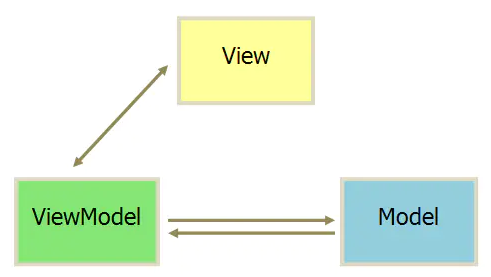
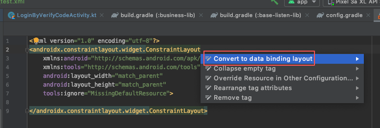
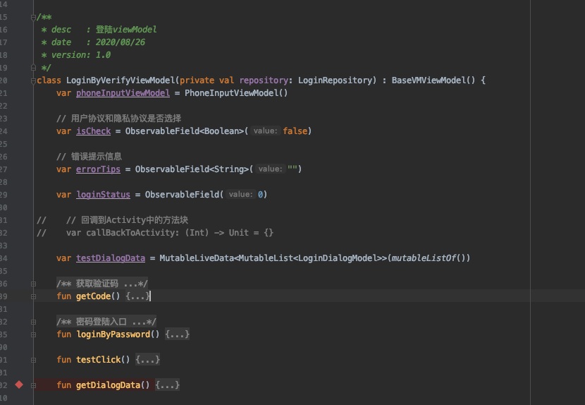
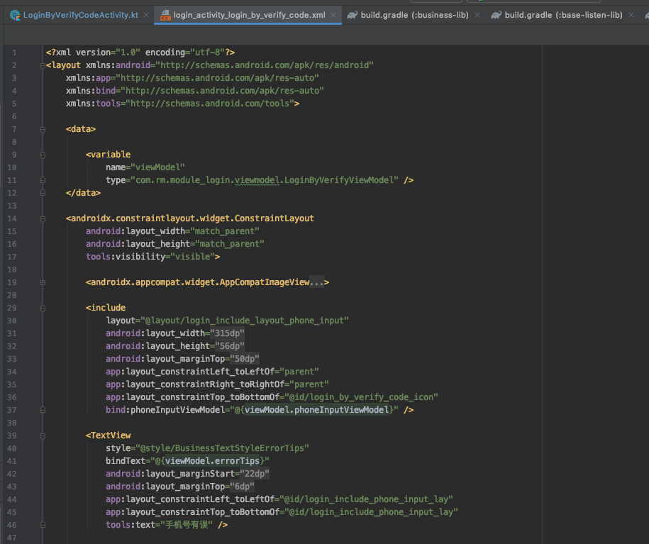
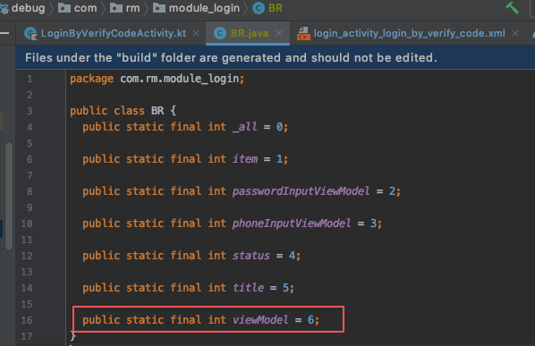
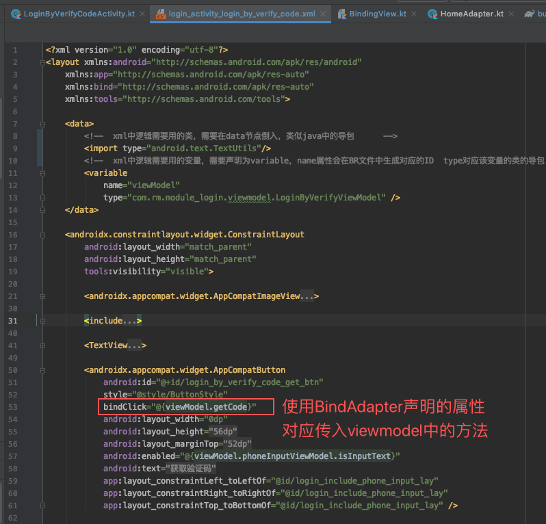
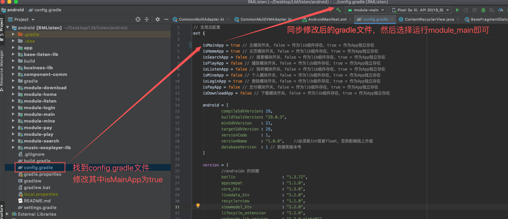
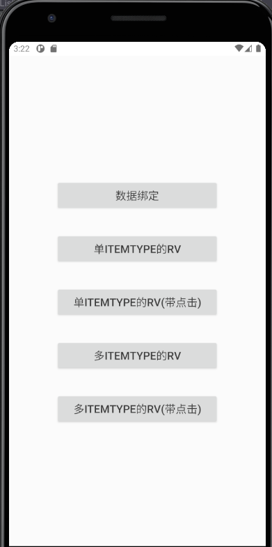

### 											新技术或开源库封装模板

#### 新技术或开源库介绍(Mvvm+Databind+LiveData)：

​	**Mvvm**：

- 与传统的Mvc，Mvp架构模式类似，Mvvm也采用三层结构：Model，View，ViewModel，其中ViewModel的功能跟Mvp中的Presenter非常接近

  

​	**Databinding**：

- DataBinding 是谷歌官方发布的一个框架，顾名思义即为数据绑定，是 MVVM 模式在 Android 上的一种实现，用于降低布局和逻辑的耦合性，使代码逻辑更加清晰。

​	**LiveData**：

- LiveData是Jetpack的一个组件，可以感知 Activity 、Fragment生命周期的数据容器。当 LiveData 所持有的数据改变时，它会通知相应的界面代码进行更新。同时，LiveData 持有界面代码 Lifecycle 的引用，这意味着它会在界面代码（LifecycleOwner）的生命周期处于 started 或 resumed 时作出相应更新，而在 LifecycleOwner 被销毁时停止更新。


#### 新技术或开源库的优缺点： 

- Mvvm

  ​	优点：

  ​			 双向绑定技术，当Model变化时，View-Model会自动更新，View也会自动变化

  ​	缺点：

​				   数据绑定使得 Bug 很难被调试

​				   项目偏大时，ViewModel层类会增多

​				   数据双向绑定不利于代码重用

- LiveData

  ​	优点：

  ​			UI和实时数据保持一致，

​			       自动管理数据的更新机制，不需要再解决生命周期带来的问题

​				   减少日常开发中因为数据持有View对象导致内存泄漏的问题

​				   解决Configuration Change问题，在屏幕发生旋转或者被回收再次启动，立刻就能收到最新的数据

​    		缺点：

​					需要对正常使用的数据进行一层包装，设置数据时，稍稍要注意下线程问题(postValue和直接.value)

- DataBinding

  ​	优点：

  ​			数据与界面可以双向绑定，减少日常开发中的各种View的设置属性，监听等等代码的编写

​			       View的功能进一步的强化，具有控制的部分功能

​				  减少View层和Model层的部分操作View属性的逻辑代码，再也不必为View层臃肿的代码而烦恼

​			缺点：

​				因为xml文件中引入了部分简单逻辑，出现语法错误有可能检测不出，导致编译或者运行出错，调试代码				难度偏大。


#### 新技术封装流程：

- 技术引入前配置依赖

  - Databinding：在使用到了databinding的模块中的build.gradle文件中的android节点下加入

    ```groovy
    buildFeatures {
        dataBinding = true
    }
    ```

  - Livedata:在使用到了LiveData的模块中的build.gradle文件中的dependencies中加入livedata，lifecycle

    的依赖

    ```groovy
    androidx.lifecycle:lifecycle-livedata-ktx:2.2.0
    androidx.lifecycle:lifecycle-extensions:2.2.0
    ```

  - 

  - 

    

- 定义基类

  例如BaseMvvmActivity,BaseMvvmFragment,BaseVmViewMoel,简化具体业务类的公共逻辑

  ```kotlin
  abstract class BaseVMActivity<V : ViewDataBinding, VM : BaseVMViewModel> : BaseActivity() 
  ```

- 定义帮助类，管理类或者工具类等等辅助相关的类

  例如DataBindingHelper,KoinHelper等等

- 使用流程(以Activity为例子)

  - 新建一个Activity，并且将Activity对应的布局文件按照提示修改为databinding类型的,

    

  - 定义该Activity对应的ViewModel(类似MVP模式中的Presenter，可以认为是对数据的操作者，包含获取，修改，删除等等)，该ViewModel中所有声明的数据类型和方法，大部分都会跟Activity中的xml文件绑定，ViewModel的作用就是声明对应View层所需的数据类型，然后通过和repository(可以为是数据的存储仓库，例如网络接口，数据库集合，本地缓存等等)的交互，对页面上的数据进行一系列操作，然后通过数据绑定，将变化后的数据直接显示在界面上。

    

  

  

  - 让该Activity继承BaseVMActivity，并指定相应的泛型类，实现抽象的方法

    ```kotlin
    /**
     * desc   : 验证码登陆界面
     * date   : 2020/08/26
     * version: 1.0
     */
    class LoginByVerifyCodeActivity : BaseVMActivity<LoginActivityLoginByVerifyCodeBinding, LoginByVerifyViewModel>() {
        companion object {
            fun startActivity(context: Context) {
                context.startActivity(Intent(context, LoginByVerifyCodeActivity::class.java))
            }
        }
    
        /**
         * 获取Avtivity的布局文件
          * @return Int
         */    
        override fun getLayoutId(): Int = R.layout.login_activity_login_by_verify_code
    
        /**
         * 获取dataBinding模式下Activity布局文件中声明的viewModel的BR的id,BR类是dataBind特有的资源ID集合类，类似于Android的R文件
         * @return Int
         */
        override fun initModelBrId() = BR.viewModel
    
        /**
         * MVVM模式开启LiveData的数据监听
         */
        override fun startObserve() {
            mViewModel.testDialogData.observe(this, Observer {
                dialogAdapter.setList(mViewModel.testDialogData.value!!)
            })
        }
    ```

- 注意事项

  - Activity的第一个泛型参数，是DataBinding框架自动根据每个xml文件对应生成的类(规则xml是每个单词首字母大写，去掉下划线然后以Binding结尾)，例如LoginByVerifyCodeActivity对应的xml文件是login_activity_login_by_verify_code，那么就会有一个LoginActivityLoginByVerifyCodeBinding，如果对应的xml文件是activity_test,那么就是ActivityTestBinding

  - BR文件也是DataBinding框架的一个自动生成的类，里面存放了，所有DataBinding形式的xml文件中声明的variable变量,例如下图中在xml中声明了一个viewModel的变量，那么在BR文件中就会有个一个viewModel的ID

    ```xml
    <data>
        <!--  xml中逻辑需要用的类，需要在data节点倒入，类似java中的导包      -->
        <import type="android.text.TextUtils"/>
        <!--  xml中逻辑需要用的变量，需要声明为variable，name属性会在BR文件中生成对应的ID  type对应该变量的类的导包    -->
        <variable
            name="viewModel"
            type="com.rm.module_login.viewmodel.LoginByVerifyViewModel" />
    </data>
    ```

  

  		

  - DataBinding框架提供了@BindAdapter注解给开发者使用，可以根据业务需求扩展View的功能，举个例子，我们需要对View的onClickListener做扩展，先使用@BindAdapter声明属性名字和具体方法执行的逻辑，然后在xml中直接使用该属性，如果xml文件与viewModel中的属性是单向绑定，使用@{}，如果是双向绑定，请使用@={}，例如EditText输入用户手机号码

    ```kotlin
    /**
     * BindingAdapter注解里面的属性名字，是可以直接用在xml中的，方法定义声明的View.bindClick
     * 代表了是对View的功能扩展，接受的参数是一个代码块，也就是方法的引用
     * @receiver View 扩展对象为View
     * @param action Function0<Unit>? 方法体(或者叫代码块)
     */
    @BindingAdapter("bindClick")
    fun View.bindClick(action: (() -> Unit)?) {
        if (action != null) {
            setOnClickListener { action() }
        }
    }
    ```

    

  

- 输出封装模板

  - 纯展示的Activity(自带数据源，且不会发生改变)继承BaseActivity，其他的Activity应该都统一继承MVVM模式的BaseVMActivity
  - 纯展示的Fragment(自带数据源，且不会发生改变)继承BaseFragment，其他的Activity应该都统一继承MVVM模式的BaseVMFragment
  - 纯展示的Dialog请使用CommonMvFragmentDialog，其他都使用CommonMvFragmentDialog
  - 纯展示的(没有点击事件)单Item的RecyclerView请使用CommonBindAdapter，涉及到逻辑操作的单Item的RecyclerView请使用CommonBindVMAdapter
  -  纯展示的(没有点击事件)多Item的RecyclerView请使用CommonMultiAdapter，涉及到逻辑操作的多Item的RecyclerView请使用CommonMultiVMAdapter

- 示例Demo

  地址：http://192.168.11.214:8087/listen_book/android/tree/develop_v1.0

   下载项目后，分支切到develop_1.0,按照下图操作即可运行demo

  


​		Demo页面

​		


